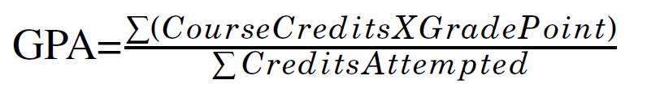
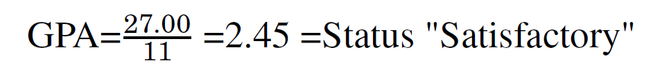
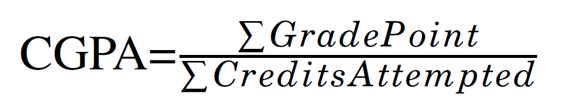
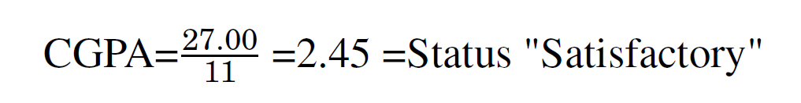

About: Gpa-Cgpa
***************

Chapter a: About GPA and CGPA DocBook
=====================================

The DocBook is about how to use the GPA and CGPA calculator. This is chapter one of the DocBook.

1.1. About the GPA and CGPA DocBook
-----------------------------------

The User Guide is authored to help the end-user[1] and the reader community to use the piece of the GPA-CGPA calculator. The user guide is simple to read with the help of the table of contents or even with the index in the guide. The preliminary research shows that one of thousand students are using the calculator to measure the GPA and CGPA. 

The User Guide is being detailed with appropriate images. This includes the necessary layout, and the actual content. The first chapter is based on the brief of the GPA and CGPA literature. The readers will enjoy while they are going through the chapter. That chapter not only helps the user of the application to know about their WH but also use the content while they are talking about the program. The Second Chapter will help the user to familia with the actual process to use the software[2]. This chapter will help the user to know how to use the program. The last but the least chapter is the source of the author and the debug[3] information. 

User feedback[4] will help the author of the program to update the program. Though the feedback is not an essential part but it always helps to the program to learn and fix the mistake. Simply, the chapter is a provision for future expansion and maintenance. 

Please enjoy the reading, and hopefully there will be a committed relationship when you choose to read the User Guide[6].

1.2. About GPA and CGPA
-----------------------

Grading in education is the process of applying standardized measurements of varying levels of achievement in a course. 

Grades[7] can be assigned in letters (for example A, B, C, D, E or F), as a range (for example 1 to 6), as a percentage of a total number correct, as a number out of a possible total (for example out of 20 or 100), or as descriptors (excellent, great, satisfactory, needs improvement). 

In some countries, all grades from all current classes are averaged to create a grade point average (GPA) for the marking period. The GPA is calculated by taking the number of grade points a student earned in a given period of time divided by the total number of credits taken[8].The GPA can be used by potential employers or educational institutions to assess and compare applicants. A Cumulative Grade Point Average is a calculation of the average of all student’s grades for all courses completed so far. 

Grades in courses are based on the instructor’s judgment[9] of a student’s achievement.

Students who dispute a grade should follow grade mediation and adjudication procedures. Semester/session grade-point average and cumulative grade-point average are calculated to represent numerically a student’s quality of performance. These averages are used to determine if a student qualifies for certain academic actions (e.g., Dean’s List, academic warning/drop, entrance to and changes in college/major, and graduation) and programs (e.g., student aid and study abroad).

1.3. Etymology
--------------

The etymology[10] of the Grade is: French grade ("a grade, degree"), from Latin gradus ("a step, pace, a step in a ladder or stair, a station, position, degree"), from gradi ("to walk, step"), from Proto-Indo-European * gh raddh -, ghreddh - ("to walk, go"). Cognate with Gothic ( griρs,"step, grade"), Bavarian Gritt ("step, stride"), Lithuanian grìdiju ("to go, wander").

1.4. History of Grading
-----------------------

Yale University historian George W. Pierson writes "According to tradition the first grades issued at Yale (and possibly the first in the country) were given out in the year 1785, when President Ezra Stiles, after examining 58 Seniors, recorded in his diary that there were ’Twenty Optimi, sixteen second Optimi, twelve Inferiores (Boni), ten Pejores [11]'" Keith Hoskin argues that the concept of grading students’ work quantitatively was developed by a tutor named William Farish and first implemented by the University of Cambridge in 1792[12]. Hoskin’s assertion has been questioned by Christopher Stray, who finds the evidence for Farish as the inventor of the numerical mark to be unpersuasive[13]. Stray’s article elucidates the complex relationship between the mode of examination (testing), in this case oral or written, and the varying philosophies of education these modes imply, both to teacher and student. As a technology, grading both shapes and reflects many fundamental areas of educational theory and practice.

1.5. Grade and Grade Point
--------------------------

Grades in courses are based on an instructor’s judgement of a student’s achievement. Semester/session grade-point average and cumulative grade-point average are calculated to represent numerically a student’s quality of performance. These averages are used to determine if a student qualifies for certain academic actions (e.g., Dean’s List, academic warning/drop, entrance to and changes in college/major, and graduation) and programs (e.g., student aid and study abroad).

1.5.1. Grade Point Average

Grades and numerical grade-point equivalents have been established for varying levels of student's academic performance. These grade-point equivalents are used to determine a student’s grade-point average.

1.5.1.1. Grade Performance and Point

+-----------------+-------------------------------+-----------+---------------+
| Performance     | Description                   | Grade     | Grade Point   |
+=================+===============================+===========+===============+
| Outstanding     | Exceptional achievement       | A+        | 4.00          |
+-----------------+-------------------------------+-----------+---------------+
| Outstanding     | Exceptional achievement       | A         | 3.75          |
+-----------------+-------------------------------+-----------+---------------+
| Outstanding     | Exceptional achievement       | A-        | 3.50          |
+-----------------+-------------------------------+-----------+---------------+
| Outstanding     | Exceptional achievement       | B+        | 3.25          |
+-----------------+-------------------------------+-----------+---------------+
| Good            | Extensive achievement         | B         | 3.00          |
+-----------------+-------------------------------+-----------+---------------+
| Good            | Entensive achievement         | B-        | 2.75          |
+-----------------+-------------------------------+-----------+---------------+
| Good            | Extensive achievement         | C+        | 2.50          |
+-----------------+-------------------------------+-----------+---------------+
| Satisfactory    | Acceptable achievement        | C         | 2.25          |
+-----------------+-------------------------------+-----------+---------------+
| Poor            | Miniamal achievement          | D         | 2.0           |
+-----------------+-------------------------------+-----------+---------------+
| Failure         | Inadequate achievement        | F         | Less than 2.00|
+-----------------+-------------------------------+-----------+---------------+

1.5.1.2. Semester or Session Grade Point Average

A student’s Grade Point Average is the weighted mean value of all grade points he/she earned by enrollment, or through credit by examination, in a semester/session of attendance at university.

1.5.1.3. Grade Point Average Calculation

To calculate a grade point average,

  1.  Determine the grade points earned in each course by multiplying course credits by the appropriate grade-point equivalent

  2.  Add the grade points earned in each course to calculate a semester total, and

  3.  Divide this sum by the number of credits taken to determine the semester/session grade point average

Equation 1.1. Gpa Calculation Method

   [Equation 1.1] Gpa calculation equation

1.5.1.4  Example how to calculate the GPA

+------------+----------------+--------------+----+---------------+-------------------+
| Course     | Grade Achieved | Credit Value |    + Grade Point   | Total Grade Point |
+============+================+==============+====+===============+===================+
| 1          | D              | 3.00         | x  | 2.00          | = 6.00            |
+------------+----------------+--------------+----+---------------+-------------------+
| 2          | C+             | 3.00         | x  | 2.50          | = 7.50            |
+------------+----------------+--------------+----+---------------+-------------------+
| 3          | B              | 1.00         | x  | 3.50          | = 3.50            |
+------------+----------------+--------------+----+---------------+-------------------+
| 4          | A-             | 3.00         | x  | 3.50          | = 10.50           |
+------------+----------------+--------------+----+---------------+-------------------+
| 5          | F              | 1.00         | x  | 0.00          | = 0.00            |
+------------+----------------+--------------+----+---------------+-------------------+
|            | Total Credits  | 11.00        |    | Total GP      | = 27:00           |
+------------+----------------+--------------+----+---------------+-------------------+

Equation 1.2. Gpa Calculation Method and Result

   [Equation 1.2] Gpa calculation result

1.5.2. Cumulative Grade Point Average

Cumulative Grade Point Average (CGPA) is based on the whole academic year evaluation or performance grade point. Usually, the CGPA is being calculate at the end of the entire academic year.

1.5.2.1. Grade Performance and Point

+-----------------+-------------------------------+-----------+---------------+
| Performance     | Description                   | Grade     | Grade Point   |
+=================+===============================+===========+===============+
| Outstanding     | Exceptional achievement       | A+        | 4.00          |
+-----------------+-------------------------------+-----------+---------------+
| Outstanding     | Exceptional achievement       | A         | 3.75          |
+-----------------+-------------------------------+-----------+---------------+
| Outstanding     | Exceptional achievement       | A-        | 3.50          |
+-----------------+-------------------------------+-----------+---------------+
| Outstanding     | Exceptional achievement       | B+        | 3.25          |
+-----------------+-------------------------------+-----------+---------------+
| Good            | Extensive achievement         | B         | 3.00          |
+-----------------+-------------------------------+-----------+---------------+
| Good            | Entensive achievement         | B-        | 2.75          |
+-----------------+-------------------------------+-----------+---------------+
| Good            | Extensive achievement         | C+        | 2.50          |
+-----------------+-------------------------------+-----------+---------------+
| Satisfactory    | Acceptable achievement        | C         | 2.25          |
+-----------------+-------------------------------+-----------+---------------+
| Poor            | Miniamal achievement          | D         | 2.0           |
+-----------------+-------------------------------+-----------+---------------+
| Failure         | Inadequate achievement        | F         | Less than 2.00|
+-----------------+-------------------------------+-----------+---------------+

1.5.2.2. Cumulative Grade Point Average

A student’s cumulative grade-point average is the weighted mean value of all grade points he/she earned by enrollment in university courses. Cumulative Grade Point Average (CGPA) refers to the overall GPA, which includes dividing the number of quality points earned in all courses attempted by the total degree-credit hours in all attempted courses. The semester or term GPA is your Grade Point Average for that one term or semester. The Cumulative GPA is you grade point average for all attempted courses in the program.

1.5.2.3. Cumulative Grade Point Average Calculation

To calculate a cumulative grade point average, total the credit hours and then the grade points from all semesters. Divide the total grade points by the total credit hours.

  1.  Determine total the credit hours from all semesters

  2.  Determine the grade points from all semesters

  3.  Divide the total grade points by the total credit hours

Equation 1.3. CGPA Calculation Method 1 [Fresh CGPA]

   [Equation 1.3] Cgpa calculation equation

Equation 1.4. CGPA Calculation Method 1 [CGPA from existing GPA]

CGPA = (Previous GPA of Semester A x Credits taken on Semester A) / (Current Semester B GPA x Current Credits Taken on Semester B) 

1.5.2.4 Example how to calculate the CGPA

+------------+----------------+--------------+----+---------------+-------------------+
| Course     | Grade Achieved | Credit Value |    + Grade Point   | Total Grade Point |
+============+================+==============+====+===============+===================+
| 1          | D              | 3.00         | x  | 2.00          | = 6.00            |
+------------+----------------+--------------+----+---------------+-------------------+
| 2          | C+             | 3.00         | x  | 2.50          | = 7.50            |
+------------+----------------+--------------+----+---------------+-------------------+
| 3          | B              | 1.00         | x  | 3.50          | = 3.50            |
+------------+----------------+--------------+----+---------------+-------------------+
| 4          | A-             | 3.00         | x  | 3.50          | = 10.50           |
+------------+----------------+--------------+----+---------------+-------------------+
| 5          | F              | 1.00         | x  | 0.00          | = 0.00            |
+------------+----------------+--------------+----+---------------+-------------------+
|            | Total Credits  | 11.00        |    | Total GP      | = 27:00           |
+------------+----------------+--------------+----+---------------+-------------------+

Equation 1.4. CGPA Calculation Method and Result

   [Equation 1.4] Cgpa calculation results

1.6. Aim of the GPA and CGPA Calculator
---------------------------------------

The GPA and CGPA calculator is an academic tool to calculate the student performance either at university or the official usage. Therefore, the following aim has been estimated based on the usage of the calculator:

  1.  To calculate the semester grade point

  2.  To calculate the performance of total academic year

  3.  The student can know how hard s/he has to work hard by calculating the possible grade

  4.  To provide the desktop based personal program

  5.  To use in the corporate environment

1.7. Grading System of Bangladesh
---------------------------------

The grading system in Bangladesh[14] is controlled by the University Grant Commission(UGC). The grading point measurement is universal for all the public and private universities[15] in Bangladesh. The following table is the grade point measurement with the minor modification (the user of the program can avoid the modification portion if s/he dislikes the fragment of the program):

Table 1.5. Grading system of Bangladesh

+------------+----------------+--------------+--------------+
| Score      | Letter grade   + Grade point  | Performance  |
+============+================+==============+==============+
| 0 - 100    | A+             | 4.00         | Outstanding  |
+------------+----------------+--------------+--------------+
| 75 - < 80  | A              | 3.75         | Outstanding  |
+------------+----------------+--------------+--------------+
| 70 - < 75  | A-             | 3.75         | Outstanding  |
+------------+----------------+--------------+--------------+
| 65 - < 70  | B+             | 3.75         | Outstanding  |
+------------+----------------+--------------+--------------+
| 60 - < 65  | B              | 3.00         | Good         |
+------------+----------------+--------------+--------------+
| 55 - < 60  | B-             | 2.75         | Good         |
+------------+----------------+--------------+--------------+
| 50 - < 55  | C+             | 2.50         | Good         |
+------------+----------------+--------------+--------------+
| 45 - < 55  | C+             | 2.50         | Satisfactory |
+------------+----------------+--------------+--------------+
| 40 - < 45  | D              | 2.00         | Poor         |
+------------+----------------+--------------+--------------+
| 0 - < 40   | F              | 0.00         | Failure      |
+------------+----------------+--------------+--------------+

------------------------------------------------------------------------

[1] An end user of a computer system or software is someone who uses it.

[2] Computer software, or just software, is any set of machine-readable instructions that directs a computer’s processor to perform specific operations. The term is used to contrast with computer hardware, the physical objects (processor and related devices) that carry out the instructions. Computer hardware and software require each other and neither can be realistically used without the other. 

[3] Debugging is a methodical process of finding and reducing the number of bugs, or defects, in a computer program or a piece of electronic hardware, thus making it behave as expected. Debugging tends to be harder when various subsystems are tightly coupled, as changes in one may cause bugs to
emerge in another. 

[4] Feedback is a process in which information about the past or the present influences the same phenomenon in the present or future. As part of a chain of Cause and Effect[5] that forms a circuit or loop, the event is said to "feed back" into itself. 

[5] A cause is WHY something happens. An effect is WHAT happens. 

[6] A user guide or user’s guide, also commonly known as a manual, is a technical communication document intended to give assistance to people using a particular system. It is usually written by a technical writer, although user guides are written by programmers, product or project managers, or other technical staff, particularly in smaller companies 

[7] http://en.wikipedia.org/wiki/Grade 

[8] Grade Point Average,(n), Retrieved November 25, 2013, http://dictionary.reference.com/browse/grade 

[9] Judgment is the cognitive process of reaching a decision or drawing conclusions. 

[10] The origin and historical development of a linguistic form as shown by determining its basic elements, earliest known use, and changes in form and meaning, tracing its transmission from one language to another, identifying its cognates in other languages, and reconstructing its ancestral form where possible. http://www.thefreedictionary.com/etymology 

[11] Pierson, George (1983). New Haven: Yale Office of Institutional Research A Yale Book of Numbers. p. 310. [12] Postman, Neil (1992). New York: Alfred A. Knopf. p. 13. 

[13] Christopher Stray, "From Oral to Written Examinations: Cambridge, Oxford and Dublin 1700 to 1914", History of Universities 20:2 (2005), 94,95.

[14] http://www.ugc.gov.bd 

[15] http://en.wikipedia.org/wiki/List_of_universities_in_Bangladesh

--------------------------------------------------------------------------
