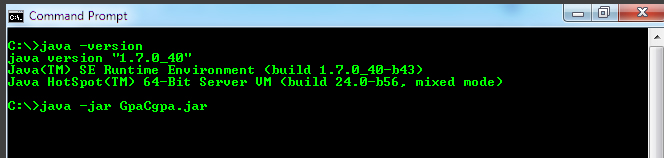
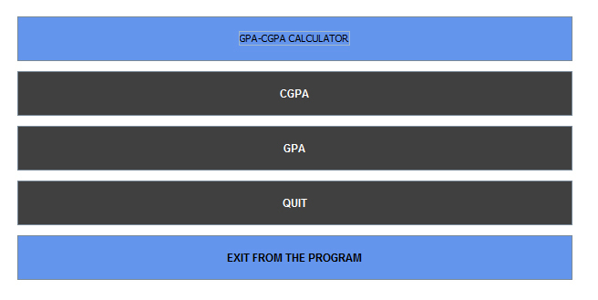
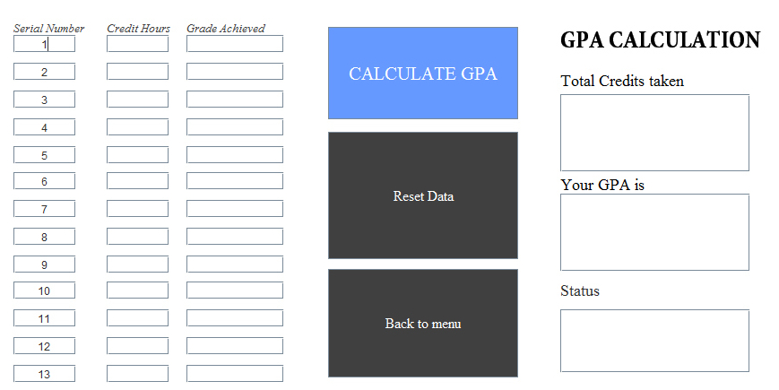
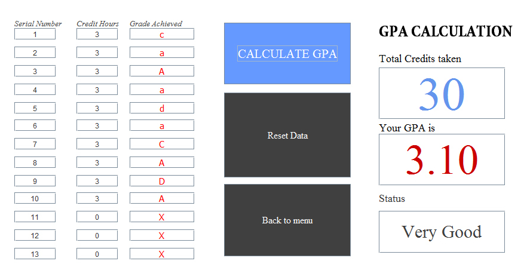
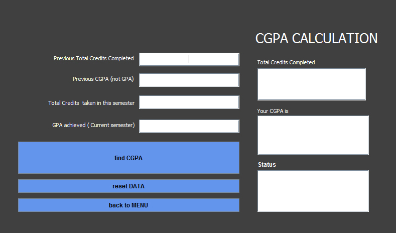
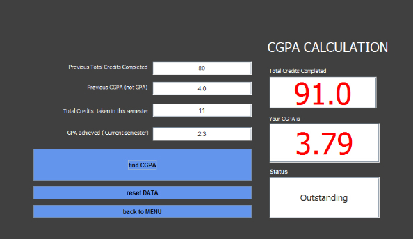

User Guide: GPA-CGPA
********************

The user guide is the frequent draft of how to use the grade point average and commulative grade point average in Bangladesh's educational perspective. Please enjoy while using the gamma version of the application fragment. The application is open source and she is ready to serve your personal `gpa_cgpa <http://sourceforge.net/projects/cgpagpa/>`__ calculations..

Chapter ii. User Guide
======================
Please enjoy while safeguarding the personalization!

2.1. Install the GpaCgpa Program
--------------------------------

To measure the Grade Point Average or Cumulative Grade Point Average program, the end user need to download the program[16] from the web link. The process to download the program is simple and the user requires few knowledge how to use the website using the web browser. It is recommended to follow the procedure given:

   Step 1: Open any web browser of your choice (Firefox, Chrome, Safari, Internet Explorer)

   Step 2: Go to the address bar and type "http://sourceforge.net/projects/cgpagpa/"

   Step 3: Click on the Download Button

   Step 4: Soon after downloading the CgpaGpa.zip, extract the file

Check that you have Java Virtual Machine(JVM) installed on your computer:

   1.  Open the Command Prompt (CMD)

   2.  Type 'java -jar GpaCgpa.jar'

   3.  The program will launch soon after providing the above command in CMD

   ..note::

     Start Menu > Programs > Accessories > Command Prompt

   ..warning::

     java -jar GpaCgpa.jar

   ..important::

        If there is no JVM installed in the computer, please visit the website to know more about how to install the necessary Java Virtual Machine and other programs:

        1. Know about JVM: http://docs.oracle.com/javase/specs/jvms/se7/html/

        2. Download the JVM and install the software in your machine: https://java.com/en/download/index.jsp

        3.  Open the Command Prompt from the Start Menu; see the notification below..

        4.  Start typing the command java -jar GpaCgpa.jar at the command prompt

        5.  The Gpa and Cgpa Calculator will launch soon after providing the above command in CMD successfully
        
 ..important::

   Java version and command to run the program

 ..note::

  Start Menu > All Programs > Accessories > Command Prompt

 ..warning::

    java -jar GpaCgpa.jar

2.2.3. Screen of the images

   
   [Figure 2.1] Java version and command to run the program

2.2. Landing Interface
----------------------

2.2.1. Description

The Landing Interface is displays the welcoming information of the GPA and CGPA calculation. There are two options is the interface:

  1. Calculator:To calculate the GPA or CGPA

  2. Exit:To end the Program fragment

2.2.2. How to use the landing interface

   Step 1: To Start the Calculation: Click on the Calculator button to start calculation the Grade Point Average (GPA) or Cumulative Grade Point Average (CGPA)

   Step 2: To Exit from the Program: Hit the Exit button

2.2.3. Screen of the Landing Interface

   .. figure::  images/1.jpg
      :align:   center

      [Figure 2.2] Welcoming interface of GPA CGPA calculator

2.3. Choice Interface
---------------------

2.3.1. Description

The Choice interface offers the end-user to choose the following options:

  1.  To calculate Cumulative Grade Point Average (CGPA)

  2.  To calculate Grade Point Average(GPA)

  3.  To back to the landing interface

  4.  To exit from the program

2.3.2. How to use the Choice Menu

   Step 1: To Calculate CGPA- Click the CGPA button

   Step 2: To Calculate GPA- Click the GPA button

   Step 3: To back to the landing interface- Click the QUIT button

   Step 4: To terminate the program- Click the EXIT FROM THE PROGRAM button

2.3.3. Screen of the Choice Interface

End user Choice menu of GPA CGPA calculator

   [Figure 2.3] End user Choice menu of GPA CGPA calculator

2.4. GPA
--------

2.4.1. Description

Grade Point Average(GPA) is the calculation which is used at the end of a semester[17]. The GPA is the key to calculate the student performance which is evaluated by the teacher or authorized person. There are two input areas where the end-user or the student requires to enter the data:

  1.  Credit Hours[18]

  2.  Grade Achieved

2.4.2. How to use the GPA

   Step 1: Enter the data in the Credit Hours and the Grade Achieved

   Step 2: Click the CALCULATE GPA button to calculate and to view the GPA, total credits, and performance status [Figure 2.5].

   Step 3: Click the Reset Data button to empty the Credit Hours and the Grade Achieved to clear the data

   Step 4: Click the Back to main button to return to the main interface [Figure 2.3]

..warning::

 Do not leave the Credit Hours and the Grade Achieved empty; Please enter ZERO (0) in the Credit Hours and enter small or capital alphabet X in the Grade Achieved box.

2.4.3. Screen of the GPA Interface

Grade Point Average (CGPA) calculation interface

   [Figure 2.4] Grade Point Average (CGPA) calculation interface

Grade Point Average calculation with sample input

   [Figure 2.5] Grade Point Average calculation with sample input

2.5. CGPA
---------

2.5.1. Description

The Cumulative Grade Point Average (CGPA) is the overall GPA of the
entire academic year[19] at the university. The CGPA is considered as the
final performance report for a student. There are four input areas where
the end-user or the student requires to enter the data:

  1.  Previous total credits completed

  2.  Previous CGPA, not GPA

  3.  Total credits taken in this semester

  4.  GPA achieved (Current Semester)

2.5.2. How to use the CGPA

   Step 1: Enter the data [Figure 2.6]

   Step 2: Hit the find CGPA button to calculate and to view the CGPA, total credits, and performance status [Figure 2.7]

   Step 3: Click the Reset Data button to empty the fields

   Step 4: Click the Back to main button to return to the main interface

2.5.3. Screen of the CGPA Interface

Cumulative Grade Point Average (CGPA) calculation interface

   [Figure 2.6] Cumulative Grade Point Average (CGPA) calculation interface

Cumulative Grade Point Average calculation with sample input

   [Figure 2.7] Cumulative Grade Point Average calculation with sample input

2.6. Debug Information
----------------------

Software Bugs[20] are everywhere. Please send the debug information to
us.

------------------------------------------------------------------------

[16] A Computer program, or just a program, is a sequence of instructions, written to perform a specified task with a computer. 

[17] A semester is an academic term. A semester system divides the academic year into two terms, which are usually 14–20 weeks each. 

[18] A course credit (often credit hour, or just credit or unit) is a unit that gives weighting to the value, level or time requirements of an academic course taken at a school or other educational institution 

[19] Academic year - the period of time each year when the school is open and people are studying, http://www.thefreedictionary.com/academic+year 

[20] A software bug is an error, flaw, failure, or fault in a computer program or system that produces an incorrect or unexpected result, or causes it to behave in unintended ways. Most bugs arise from mistakes and errors made by people in either a program’s source code or its design, or in frameworks and operating systems used by such programs, and a few are caused by compilers producing incorrect code. A program that contains a large number of bugs, and/or bugs that seriously interfere with its functionality, is said to be buggy. Reports detailing bugs in a program are commonly known as bug reports, defect reports, fault reports, problem reports, trouble reports, change requests, and so forth

-----------------------------------------------------------------------

